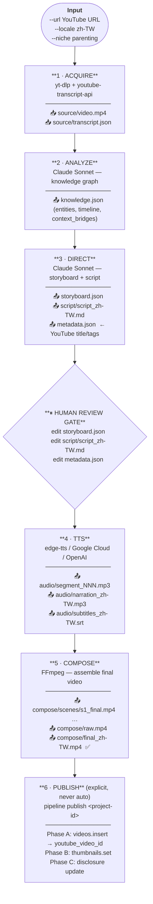
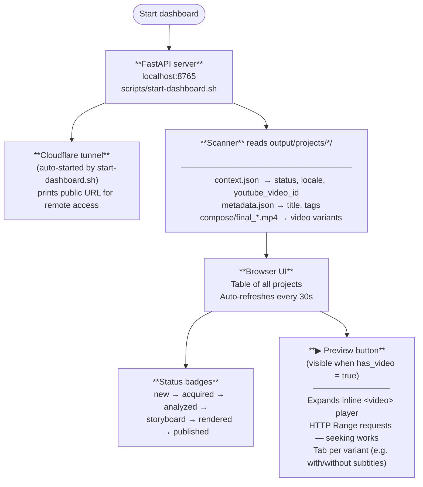

# Pipeline Workflows

Quick reference for the two main use cases. Open this before starting any session.

---

## Use Case 1: `produce` — Make a Video

### Command

```bash
uv run pipeline produce \
  --url "https://youtube.com/watch?v=..." \
  --locale zh-TW \                        # zh-TW | ja | es-MX
  --niche parenting \                     # auto-detected from channels.toml; use "none" to skip metadata
  --voice tim-zhtw \                      # optional; auto-selects per locale
  --start-from tts \                      # skip to a stage (see resume table below)
  --skip-review \                         # bypass human review gate (auto-fix proofreading)
  --subtitles                             # burn subtitles into final video
```

---

### Stage Flow



---

### Output Directory (per project)

```
output/projects/{project_id}/
├── context.json                  ← pipeline state; enables resume
├── metadata.json                 ← YouTube title, description, tags
├── source/
│   ├── video.mp4                 ← downloaded source
│   └── transcript.json
├── knowledge.json                ← story facts, entities, gaps
├── storyboard.json               ← scene-by-scene plan  ← EDIT HERE
├── script/
│   └── script_zh-TW.md          ← narration text        ← EDIT HERE
├── audio/
│   ├── segment_000.mp3 …        ← per-scene clips
│   ├── narration_zh-TW.mp3      ← full narration
│   └── subtitles_zh-TW.srt
└── compose/
    ├── scenes/                   ← intermediate renders
    ├── raw.mp4
    └── final_zh-TW.mp4          ← FINAL OUTPUT ✅
```

---

### Resume / Re-run a Specific Stage

| I want to redo… | Command |
|---|---|
| Everything from scratch | `uv run pipeline produce --url "…" --locale zh-TW` |
| From analyze onward | `uv run pipeline produce --url "…" --locale zh-TW --project-id <ID> --start-from analyze` |
| From direct onward (re-script) | `… --start-from direct` |
| TTS only (re-voice after edits) | `… --start-from tts` |
| Compose only (re-render) | `… --start-from compose` |
| Just the storyboard text | `uv run pipeline storyboard set scene_003 narration="新文字"` then `--start-from tts` |

> **Note:** `--start-from tts` and `--start-from compose` load `context.json` automatically — no `--url` needed if you provide `--project-id`.

---

### Storyboard editing helpers

```bash
uv run pipeline storyboard show                        # list all scenes
uv run pipeline storyboard show --scene scene_003      # one scene's full text
uv run pipeline storyboard recordings --voice tim-zhtw # recording status per scene
uv run pipeline storyboard set scene_003 narration="…" # edit field in-place
```

---

### Metadata editing helpers

```bash
uv run pipeline metadata show --work-dir output/projects/<ID>
uv run pipeline metadata set title="新標題" --work-dir output/projects/<ID>
uv run pipeline metadata regenerate --work-dir output/projects/<ID>
```

---

## Use Case 2: Dashboard — Check & Preview Videos

### Flow



### Commands

```bash
# Remote access (starts tunnel, prints public URL)
./scripts/start-dashboard.sh

# Local only
./scripts/start-dashboard.sh --local-only

# Custom port
./scripts/start-dashboard.sh --port 9000

# Or direct (no tunnel, no auto-browser open)
uv run pipeline dashboard --no-browser --port 8765
```

### What the scanner exposes per project

| Field | Source |
|---|---|
| `status` | file existence: `video.mp4` → `knowledge.json` → `storyboard.json` → `final_*.mp4` → `youtube_video_id` |
| `title` | `metadata.json` |
| `tags` | `metadata.json` (first 5 shown) |
| `video_variants` | all `compose/final_{locale}*.mp4` files |
| `youtube_video_id` | `context.json` |
| `source_url` | `context.json` |

---

## Isolation Map — What to Edit for Each Problem

| Problem | Edit this file | Then re-run from |
|---|---|---|
| Wrong facts / missing context | `knowledge.json` | `--start-from direct` |
| Bad scene structure / story arc | `storyboard.json` | `--start-from tts` |
| Wrong narration text | `storyboard.json` or `script/script_zh-TW.md` | `--start-from tts` |
| Bad voice / audio timing | TTS config or `--voice` flag | `--start-from tts` |
| Bad video composition / subtitles | compose config or `--subtitles` flag | `--start-from compose` |
| Wrong YouTube title/tags | `metadata.json` | `pipeline metadata set …` then re-publish |
